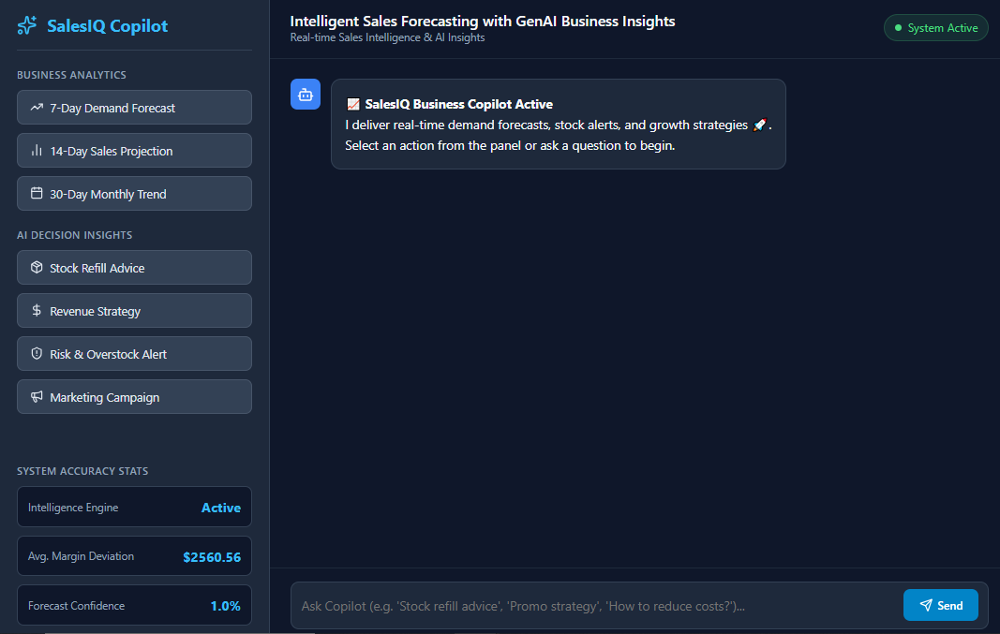
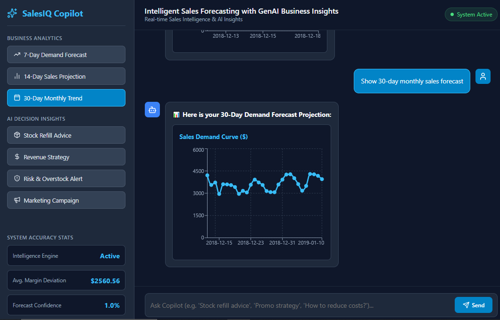
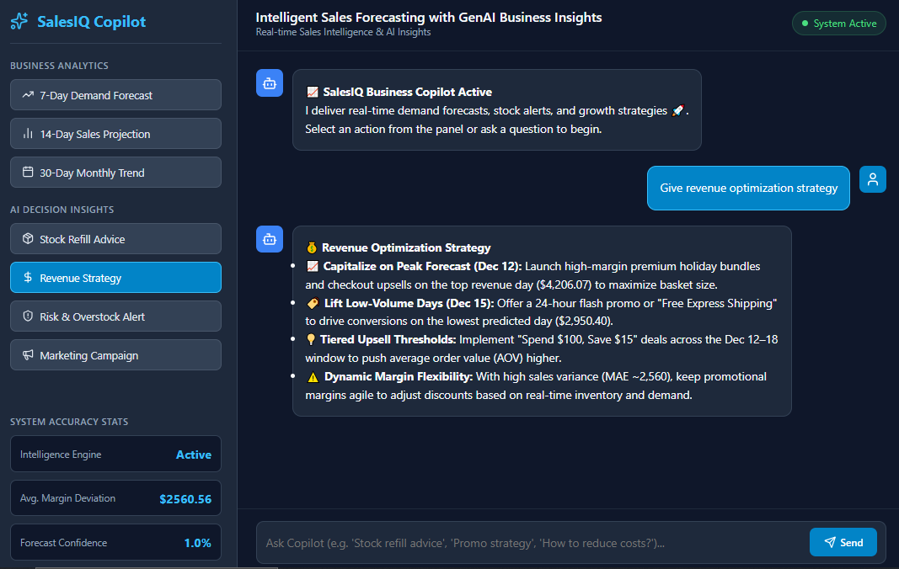

# 📈 SalesIQ - Intelligent Sales Forecasting with GenAI Business Insights

SalesIQ is an end-to-end AI/ML business intelligence platform designed to deliver real-time demand forecasts, automated inventory optimization, and strategic growth recommendations using predictive ML models and GenAI capability.

🔗 **Live Demo:** [SalesIQ Web App](https://salesiq-oyey.onrender.com)
---

## 🚀 Key Features

* 📊 **Demand Forecasting:** Generates 7, 14, and 30-day sales demand forecasts using ML.
* 🤖 **GenAI Business Copilot:** Uses Google Gemini API (`gemini-2.0-flash`) to convert raw sales data into actionable business insights.
* 📦 **Inventory Recommendations:** Provides stock refill recommendations and overstock risk alerts.
* 📈 **Sales Analytics:** Visualizes historical and predicted sales trends using interactive charts.
* 💬 **AI Chat Assistant:** Interactive business copilot for instant sales and operational queries.
* 📢 **Marketing Suggestions:** Generates promotional strategies, email templates, and SMS content.
* 📏 **Model Evaluation:** Real-time tracking of MAE and R² metrics for forecast performance.
* 🐳 **Dockerized Deployment:** Fully containerized microservices architecture ready for cloud production.

---

## 🛠️ Tech Stack & Architecture

* **Frontend:** React.js, Recharts, Lucide Icons, React Markdown, Axios
* **Backend API:** FastAPI, Python, Uvicorn, Pydantic, Python-Dotenv
* **Data & ML Engine:** Scikit-learn (Random Forest Regressor), Pandas, NumPy
* **Containerization & Cloud:** Docker, Docker Hub, Render 
* **Generative AI:** Google gemini API(google-genai / gemini-2.0-flash)

---
## 📸 App Screenshots & Architecture

Explore the UI workspace and core modules:

📁 **View All Visual Assets:** [Screenshots Folder](./img)

### 1. Main Copilot Workspace


### 2. Predictive Sales Demand Forecast


### 3. AI Strategic Insights & Risk Alerts


---
## 🧠 Machine Learning Pipeline

SalesIQ uses a **Random Forest Regressor** for sales forecasting. The end-to-end data pipeline includes:

1. **Historical Sales Data Collection:** Ingestion of daily transaction data.
2. **Data Cleaning & Preprocessing:** Handling null values, duplicate removal, and datetime formatting.
3. **Time-Based Feature Engineering:** Temporal features like `month`, `day_of_week`, and `is_weekend`.
4. **Lag & Rolling Features:** Capture sales momentum via `sales_lag_1` and `sales_rolling_7`.
5. **Model Training & Forecasting:** Multi-step forecasting for 7, 14, and 30-day horizons.
6. **Model Evaluation:** Automated validation tracking MAE and R² metrics.

---
## 🤖 Generative AI Integration

SalesIQ integrates the Google Gemini API through the FastAPI backend to deliver intelligent business recommendations, including:

* 📦 Inventory refill recommendations and safety stock levels
* ⚠️ Overstock and holding-cost risk alerts
* 💰 Revenue optimization strategies & dynamic pricing tips
* 📢 Email & SMS promotional campaign ideas
* 📊 Natural-language explanations of complex sales trends

---

## 🏗️ System Architecture

```text
                    ┌──────────────────────┐
                    │      React.js        │
                    │    Frontend UI       │
                    └──────────┬───────────┘
                               │
                               │ REST API
                               ▼
                    ┌──────────────────────┐
                    │       FastAPI        │
                    │     Backend API      │
                    └───────┬───────┬──────┘
                            │       │
                 ┌──────────┘       └──────────┐
                 ▼                             ▼
       ┌──────────────────┐          ┌──────────────────┐
       │  ML Forecasting  │          │   Gemini API     │
       │ Random Forest    │          │  GenAI Insights  │
       └────────┬─────────┘          └────────┬─────────┘
                │                             │
                └──────────────┬──────────────┘
                               ▼
                    ┌──────────────────────┐
                    │ Business Insights &  │
                    │ Demand Predictions   │
                    └──────────────────────┘
```
## 💻 Local Development Setup

### 1. Repository Clone
```bash
git clone [https://github.com/your-username/SalesIQ.git](https://github.com/your-username/SalesIQ.git)
cd SalesIQ
```
### 2. Backend Setup
```bash
cd backend
python -m venv venv
source venv/bin/activate  # On Windows: venv\Scripts\activate
pip install -r requirements.txt
uvicorn main:app --reload --port 8000    # Start FastAPI server
````
Note: Make sure to create a .env file in the backend/ folder containing your GEMINI_API_KEY.

### 3. Frontend Setup
```bash
cd ../frontend
npm install
npm start
```
**Frontend:** http://localhost:3000
**Backend API Docs:** http://localhost:8000/docs

##🐳 Docker Deployment Guide
Build & Run Container Images
### Backend Container
```bash
cd backend
docker build -t salesiq-backend .
docker run -p 8000:8000 --env-file .env salesiq-backend
```
### Frontend Container
```bash
cd frontend
docker build \
  --build-arg REACT_APP_API_URL=[https://salesiq-backend-2pkb.onrender.com/api](https://salesiq-backend-2pkb.onrender.com/api) \
  -t salesiq-frontend .
docker run -p 80:80 salesiq-frontend
```

##🔗 Production Links
🌐 Live Frontend Web App: https://salesiq-oyey.onrender.com
⚡ Live Backend REST API: https://salesiq-backend-2pkb.onrender.com

## 📊 Model Evaluation
The forecasting model performance is evaluated using:
**Mean Absolute Error(MAE):** Measures the average absolute magnitude of prediction errors.
**R² Score (Coefficient of Determination):** Measures how well the Random Forest model captures the variance in daily sales.
